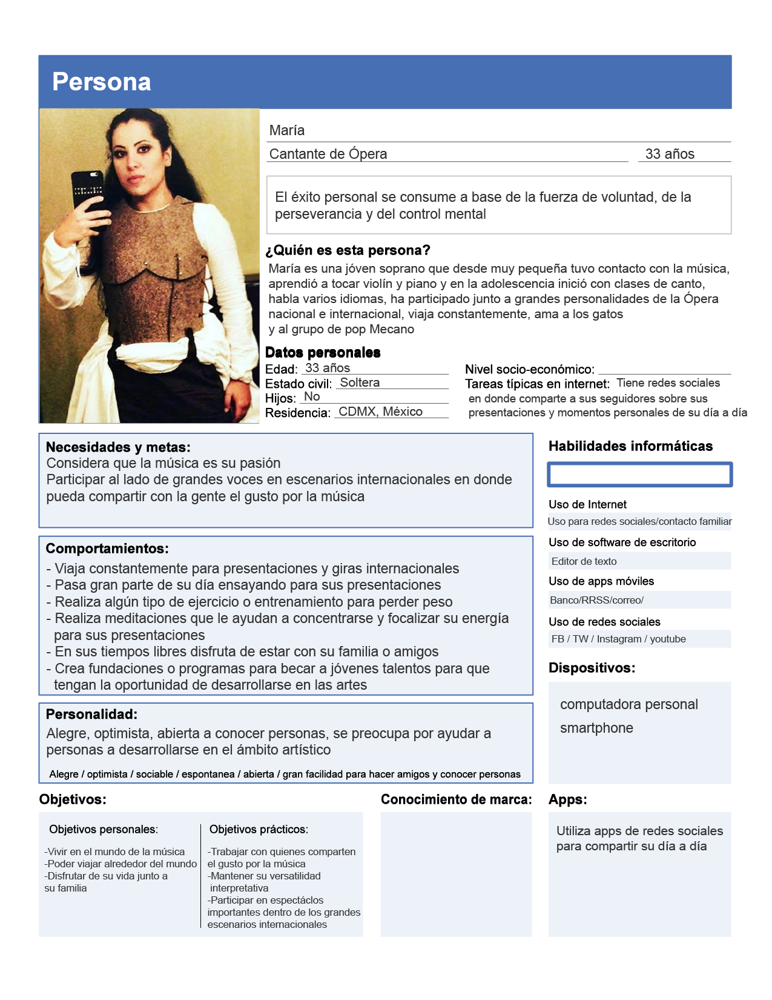

# Proceso de creación user persona

Del research realizado dsobre cantantes de ópera me enfonqué en sólo mujeres, sobre todo de la escena mexicana.

Para ello observé algunos videos y realizcé una investigación a través de su redes sociales para averigüar un poco más sobre lo que normalmente no vemos en los escenarios.

Antes de saber como se construye un User Persona mi visión de una cantante de ópera era como una persona llena de glamour y excentricidades, que vivían alejados de la “gente común” inmersas dentro del mundo de la música, sus ensayos y preparación para esos grandes espectáculos

Sin embargo al pasar a la investigación, centrándome sólo en mujeres cantantes de ópera, me di cuenta que mi idea inicial era muy alejada de la realidad, si bien gran parte de su tiempo lo dedican a prepararse para sus presentaciones, viven una vida sencilla la mayor parte del tiempo, la transformación y el glamour solo lo viven dentro del espectáculo.

La gran mayoría comparten su vida cotidiana en sus redes sociales y están en contacto con su público y fans. Si bien algunas aún conservan una imagen de divas, muchas otras sólo mantienen esa imagen en el escenario.

Otra cosa que tienen en común es que iniciaron su preparación desde una edad muy temprana, aprendieron a tocar uno o más instrumentos pero finalmente decidieron que el canto era su vida.

Viajan constantemente y ello pudiera hacerlas un poco solitarias y alejadas de su familia, pero en realidad están en contacto constante, sobre todo aquellas que han decidido combinar su profesión con la maternidad y muestran una vida totalmente común.

[User persona en Drive](https://drive.google.com/open?id=14lYX8A4OL7NHkBIj2qUMyB7UgSR0CBVP)
